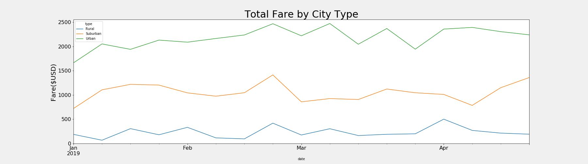

# PyBer_Analysis

## Overview of Analysis
The goal of this analysis is to create a multiple-line graph that shows the total weekly fares for each city type. PyBer operates in three types of cities: urban, suburban, and rural. Previously, we analyzed the ride count, average fare per ride, and average number of drivers, all categorized by the type of city. Additionally, we compared each city's metrics and the average ride fare to the total number of rides per city. For this challenge, we took it a step further and created a summary data frame that organized total rides, total drivers, total fares, average fare per ride, and average fare per driver and the multiple line plot.

## Results

Analyzing the summary data frame, we can see a trend between a city's population and the total number of rides. This correlation directly affects the total number of drivers, total fare collected, and their averages. As a city become further from an urbanized area, they get fewer drivers and fares. Despite this, the average far per ride and fare per driver actually increase. This phenomenon can be explained by PyBer users having less drivers available in more rural areas. The decrease in the amount of drivers means the average far per rider and driver will be higher. The distance covered in rural areas may also affect the higher price per rider and driver in rural areas. 

Looking at the multi-line chart created, we can compare total fares by the city typer of a 5-month period. The number of rides completed seems to peak at the end of February and fluctuates during March. The graphs tend to follow the same trend through the 5-month period, except for in suburban cities. There, we see a more visible increase during April.

## Summary

After analyzing the data, we are prepared to offer three direct recommendations to address disparities among the different city types PyBer operates in:

1) Seeing how the total fare for suburban cities increases during April, the company should analyze what caused this specific increase to see if the deciding factors could be used in other city types and during other months.

2) The data also shows us the average far per ride and driver is higher when less drivers are available. This may lead to a 'win-win' scenario for PyBer where they can hire less drivers but gain higher averages for those drivers in cities. More analysis would have to be done to see if this trend is because of rural cities' supply vs. demand situation or if it can be applied to other urban centers as well.

3) PyBer is missing profits in rural cities due to not enough drivers. The average fare per ride shows a gradual increase from more populated cities to less. However, the average fare per driver drastically increases among this same shift. This may indicate that the driver amount is lower than needed to optimized PyBer's profits in rural areas.
